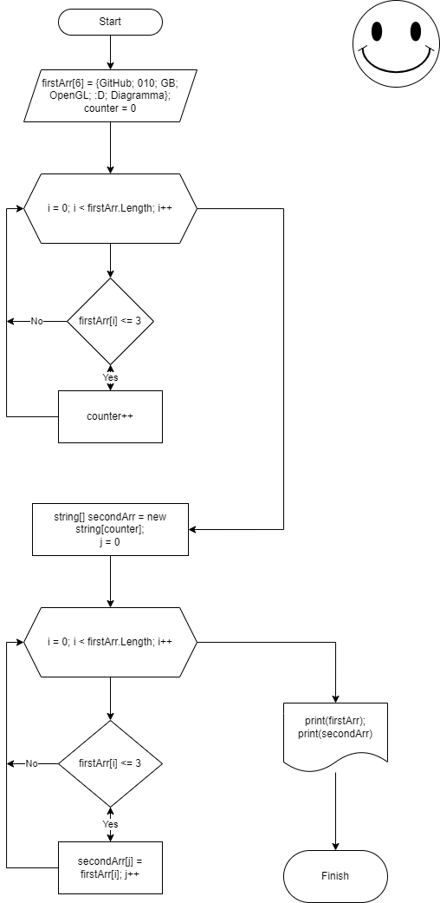

# *Итоговая проверочная работа*

**Задача**

Написать программу, которая из имеющигося массива строк формирует массив из строк, длина которых меньше либо равна 3 символа. Первоначальный массив можно ввести с клавиатуры, либо задать на старте выполнения алгоритма. При решении не рекомендуется пользоваться коллекциями, лучше обойтись исключительно массивами.

**Примеры:**

["hello", "2", "world", ":-)"] --> ["2", ":-)"]

["1234", "1567", "-2", "computer"] --> ["-2]

***Для выполнения проверочной работы необходимо:***

- Создать репозиторий на GitHub;
- Нарисовать блок-схему алгоритма (можно обойтись блок-схемой основной содержательной части, если вы выделяете ее в отдельный метод);
- Снабдить репозиторий оформленным текстовым описанием решения;
- Написать программу, решающую поставленную задачу;
- Использовать контроль версий в работе над проектом (несколько коммитов).

**Решение задачи:**

1. Начинам с того, что создаем новый массив *firstArr*.
2. Задаем ему значения элементов. В данном случае это шесть элементов: "GitHub", "010", "GB", "Open", ":D", "Diagramma".
3. Далее подключаем счетчик *count* с первоначальным значением 0.
4. Цикл *for* со счетчиком i. Работать этот цикл будет пока счетчик i будет меньше (<) созданного массива *firstArr*.
5. Далее внутри цикла создаем условие *if* и проверяем длину элемента. Если она меньше или равна 3, то увеличиваем счетчик на 1. Если длина элемента больше 3, то переходим к следующему элементу.
6. Выходим из первого цикла и попадаем во второй созданный массив *secondArr*. Задаем счетчик *j*.
7. Новый цикл *for* со счетчиком i, который работает пока i меньше *firstArr.Length
8. Внутри цикла создаем условие if и снова проверяем длину элемента первого массива. Если она меньше или равна 3, то помещаем данный элемент во второй массив. Если длина элемента больше 3 символов, пропускаем элемент и переходим к следующему.
9. После выхода из второго цикла печатаем первоначально заданный массив и второй массив, содержащий в себе только подходящие элементы первого.